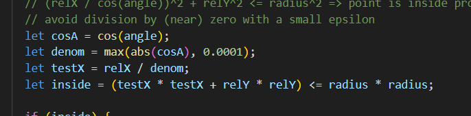

first i created the random 10 priont patern that was tought to us in the class 
ratther than using innerWidth,innerHeight i used  windowWidth,windowHeight bcs it enables me to use WEBGL which is important for rendering in 3D 
i used circle iquation on graph to create a disc and used cos function for its rotation as the starting value of CosX is 1 means the disc is flat 
but i made sure the denominator is not less than zero bcs it would crash the code
