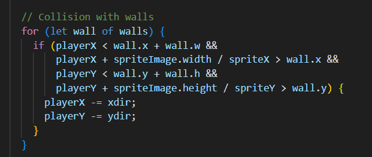

first i used the code provided by mathura ma'am to understand the sprite function 
then i added an array of 13 imagess to create my walls for the maze 

to create the collision i marked the position of walls and the player if the player and the walls have itersecting coordinate the program will minus a single position and reduced frame count gives the illusion of smooth animation so that the charactre looks stationary 

for the end text i created a false situation that wont be true untill the player comes in contact with the castle 

as soon as the player comes in contact with castle the code stopes taking any input and displayes the message 
