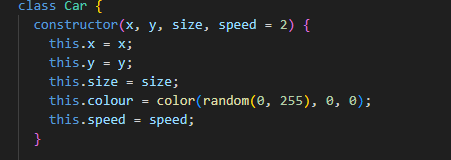
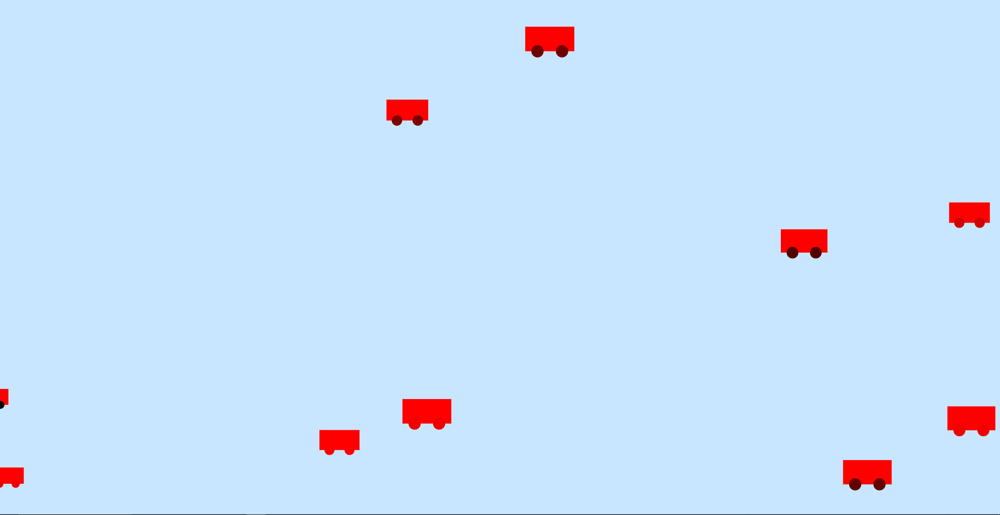

Using Classes to create  moving cars from left right with random red colour

firstly i created the class for cars where size can be inputed by the user

i didnt knew how to use the move function bcs i was not present in the class at that moment  so i checked out others code on how to do it 
but ran into some issues

after recreating the code and getting the results i changed the flowers with cars and got the desired result

